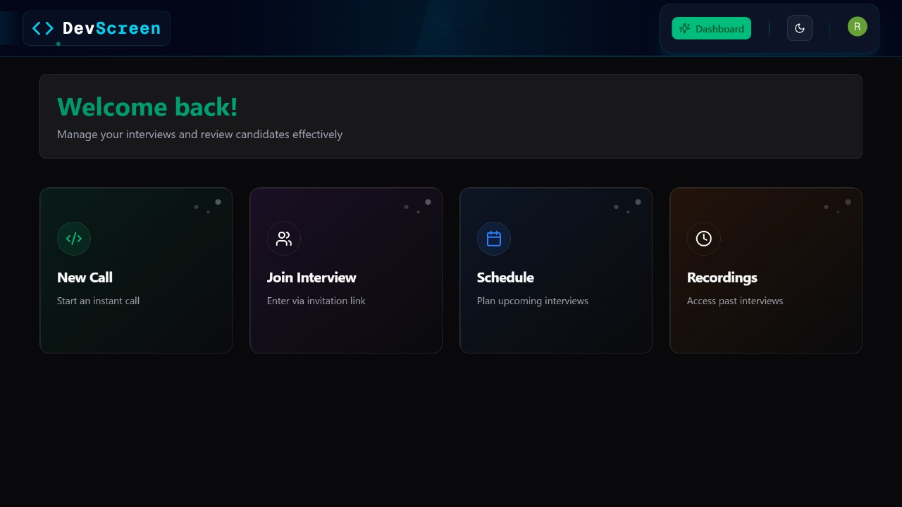
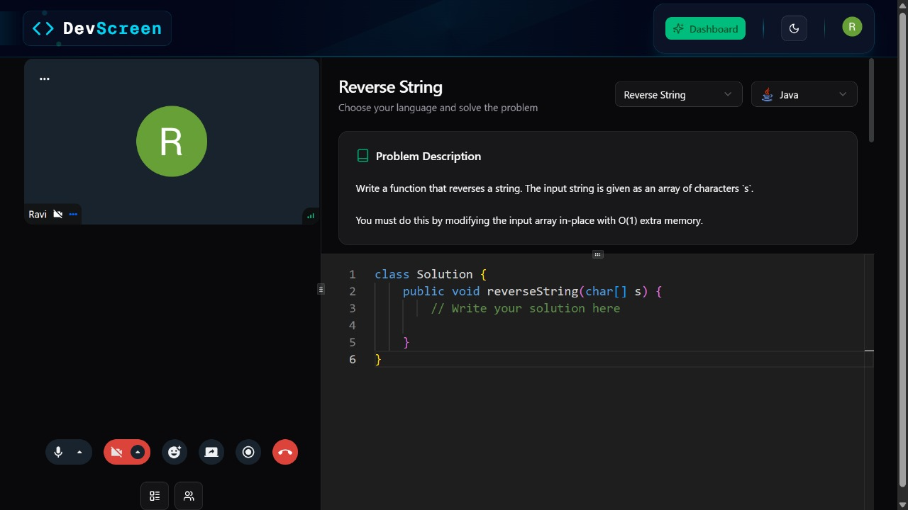
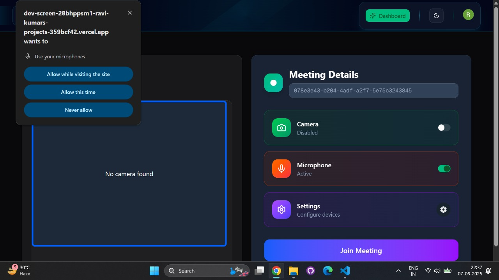
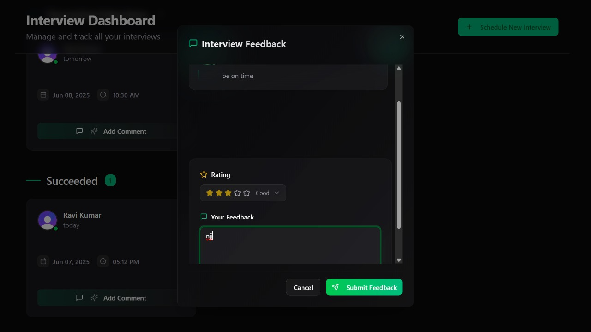

# DevScreen - Online interview Platform

DevScreen is a modern, full-stack platform designed for conducting remote technical interviews with real-time video capabilities. Built with Next.js, Tailwind CSS, TypeScript, and powered by GetStream, Convex, and Clerk, it offers a seamless and secure interview experience. Also code editor are available for writing code.

## 🚀 Features

- 💻 Built with **Next.js** and **TypeScript** for performance and type safety.
- 🎨 Styled using **Tailwind CSS** for rapid and responsive UI development.
- 🎞️ Smooth animations with **Framer Motion**.
- 🔐 Secure authentication using **Clerk**.
- 📡 Real-time video calling powered by **GetStream**.
- 📦 Backend logic and data persistence handled with **Convex**.

## 📸 ScreenShots






---

## 🛠️ Tech Stack

| Technology    | Purpose              |
| ------------- | -------------------- |
| Next.js       | Frontend framework   |
| TypeScript    | Type-safe JavaScript |
| Tailwind CSS  | Styling              |
| Framer Motion | Animations           |
| Clerk         | Authentication       |
| Convex        | Serverless backend   |
| GetStream     | Real-time video SDK  |

## 🔗 Live Demo

👉 [Visit DevScreen on Vercel](https://dev-screen-seven.vercel.app/)

---

## 🛠️ Getting Started

### 1. Clone the repository

```bash
git clone https://github.com/developer-ravi-03/DevScreen.git

cd DevScreen
```

### 2. Install dependencies

```bash
npm install
```

### 3. Configure Environment Variables

Create a .env.local file in the root directory and add necessary API keys for:

```bash
//Clerk
NEXT_PUBLIC_CLERK_PUBLISHABLE_KEY=
CLERK_SECRET_KEY=

//Convex
CONVEX_DEPLOYMENT=
NEXT_PUBLIC_CONVEX_URL=

//GetScreen
NEXT_PUBLIC_STREAM_API_KEY=
STREAM_SECRET_KEY=
```

### 4. Run the backend server

```bash
npx convex dev
```

### 5. Run the server

```bash
npm run dev
```

Open [http://localhost:3000](http://localhost:3000) with your browser to see the result.

# 👋 Connect with Me

- 🔗 **LinkedIn** - [ItzRavi](https://www.linkedin.com/in/itzravi/)
- 🌐 **Portfolio** - [Ravi Kumar](https://portfolio-website-next-hazel.vercel.app/)
